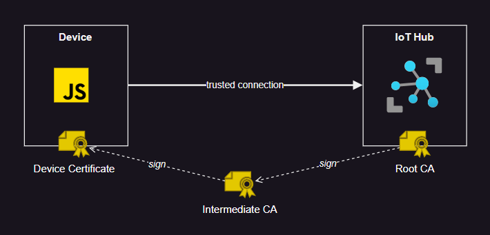

# Azure IoT Hub - CA Signed device



## 1 - Create the IoT Hub


```sh
# IoT Hub
az group create --name IoTEdgeResources --location westus2
az iot hub create --resource-group IoTEdgeResources --name iothub789 --sku F1 --partition-count 2 --mintls "1.2"

# Upgrade the root to V2 if required
az iot hub certificate root-authority set --hub-name iothub789 --certificate-authority v2
az iot hub certificate root-authority show --hub-name iothub789
```

## 2 - Create the Root certificate

Prepare the OpenSSL structure:

```
cd openssl

mkdir certs csr newcerts private
touch index.txt
openssl rand -hex 16 > serial
```

Create the root CA private key:

```
openssl genrsa -aes256 -passout pass:1234 -out ./private/azure-iot-test-only.root.ca.key.pem 4096
```

Create the root CA certificate:

```
openssl req -new -x509 -config ./openssl_root_ca.cnf -passin pass:1234 -key ./private/azure-iot-test-only.root.ca.key.pem -subj '/CN=Azure IoT Hub CA Cert Test Only' -days 30 -sha256 -extensions v3_ca -out ./certs/azure-iot-test-only.root.ca.cert.pem
```

Examine the certificate:

```
openssl x509 -noout -text -in ./certs/azure-iot-test-only.root.ca.cert.pem
```

## 3 - Intermediate CA certificate

Create the CA private key:

```
openssl genrsa -aes256 -passout pass:1234 -out ./private/azure-iot-test-only.intermediate.key.pem 4096
```

Create the CSR:

```
openssl req -new -sha256 -passin pass:1234 -config ./openssl_device_intermediate_ca.cnf -subj '/CN=Azure IoT Hub Intermediate Cert Test Only' -key ./private/azure-iot-test-only.intermediate.key.pem -out ./csr/azure-iot-test-only.intermediate.csr.pem
```

Sign the intermediate certificate with the root CA certificate:

```
openssl ca -batch -config ./openssl_root_ca.cnf -passin pass:1234 -extensions v3_intermediate_ca -days 30 -notext -md sha256 -in ./csr/azure-iot-test-only.intermediate.csr.pem -out ./certs/azure-iot-test-only.intermediate.cert.pem
```

Examine:

```
openssl x509 -noout -text -in ./certs/azure-iot-test-only.intermediate.cert.pem
```

## 4 - Device certificates

Create the Device-01 private key:

```
openssl genrsa -out ./private/device-01.key.pem 4096
```

Create the Device-01 CSR:

> CN must follow standard

```
openssl req -config ./openssl_device_intermediate_ca.cnf -key ./private/device-01.key.pem -subj '/CN=device-01' -new -sha256 -out ./csr/device-01.csr.pem
```

Sign the certificate with the intermediate CA:

```
openssl ca -batch -config ./openssl_device_intermediate_ca.cnf -passin pass:1234 -extensions usr_cert -days 30 -notext -md sha256 -in ./csr/device-01.csr.pem -out ./certs/device-01.cert.pem
```

Examine the certificate:

```
openssl x509 -noout -text -in ./certs/device-01.cert.pem
```

Create the certificate chain for Device-01:

```
cat ./certs/device-01.cert.pem ./certs/azure-iot-test-only.intermediate.cert.pem ./certs/azure-iot-test-only.root.ca.cert.pem > ./certs/device-01-full-chain.cert.pem
```

## 5 - Register the device

Upload the root CA certificate:

```sh
az iot hub certificate create -n "Test-Only-Root" --hub-name iothub789 -g IoTEdgeResources -p openssl/certs/azure-iot-test-only.root.ca.cert.pem -v true
```

Register the device:

```sh
az iot hub device-identity create \
    --device-id "device-01" \
    --hub-name iothub789 \
    --auth-method x509_ca
```

## 6 - Device connection

Copy the full chain cert and the private key to the device:

```
mkdir device/config
cp openssl/certs/device-01-full-chain.cert.pem device/config/full-chain.cert.pem
cp openssl/private/device-01.key.pem device/config/key.pem
```

Create the `.env`:

```sh
# Global DPS hostname
IOTHUB_HOST="iothub789.azure-devices.net"

# Device ID (must match certificate)
PROVISIONING_REGISTRATION_ID="device-01"

# Public Cert (Full Chain)
CERTIFICATE_FILE="config/full-chain.cert.pem"

# Private Key
KEY_FILE="config/key.pem"
```

Install and run:

```sh
npm i
node connect_x509.js
```
